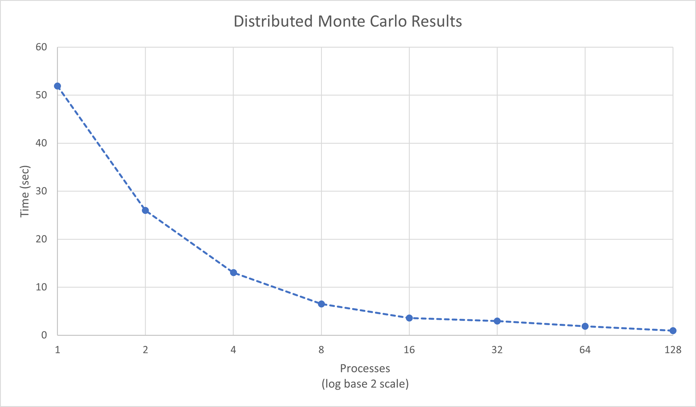

# Monte Carlo Pi Simulation with MPI

> Adapted from a class project in High Performance Computing at the University of Tulsa.

The goal of this program is to build a serial and distributed version of a Monte Carlo simulation, with the intent of generating estimations of Pi. We want to collect the time for runs on 1, 2, 4, 8, 16, 32, 64 and 128 cores, then graph our results.

## Methodology: Serial
First, I started by creating a serial implementation of the Monte Carlo Simulation. This implementation followed a very basic pseudocode outline, based on the provided pseudocode outline. This outline appeared as follows:

```
number in circle = 0;
while (result is outside of tolerance) { 
	x = random double between -1 and 1;
	y = random double between -1 and 1;
	distance squared = x*x + y*y;
	if (distance squared <= 1)
		number in circle++;
	result = 4* ( hit / number of tosses );
}
Final pi estimate = 4*number in circle/((double) number of tosses);
```

The only part of this that became complicated was implementing the random number function correctly, because I had to modify C's default `rand()` function to get a proper output. This was to limit the input/output to be within a certain integer range. This looks as follows:

```c
double randRange(int min, int max){
	return min + ((rand() / (double) (RAND_MAX))*(max-min));
}
```

After this it could be compiled as follows:

```bash
gcc -Wall -o serialTest.o montePi_Serial.c
```

## Methodology: Parallel

In order to turn this into a parallel program, I created a communication scheme and pseudocode for parallelizing this system. This involved broadcasting the total number of tosses to be performed, each piece doing their tosses, and then reducing the answers back to the root node. This roughly looks like follows:
```
Broadcast total number of tosses to all nodes
Each node calculates their own responsibility
Each node runs a limited Monte Carlo
Reduce hits and tosses to the root node
```

For this program, I used a simple work divider that will split the work between the nodes as evenly as possible, even if the division isn't clean. I did this by distributing the remainder tasks among the last remainder-number of processes in the system. The basic C code for this process is shown below:
``` c
// mToss received from broadcast
long long int indToss = 0;
indToss = floor(mToss/commSz);
int r = (mToss)%(commSz);
if(rank>commSz-r){
	indToss++;
}
```

From here, each node goes on their own, basic Monte Carlo simulation just like in the serial version of the program, each one running their own independent set of throws. After that, the nodes then call a reduce functionality to sum all the values into the root node for the final estimation of pi. This program was then compiled, using `mpicc` as follows:

```
mpicc montePi_Dist.c -o amonteDist.o
```

## Results

This simulation resulted in some interesting timings. I used the clock iterations to measure time, in order to offer a better granularity on my measurements. This methodology looks as follows in code:

```c
clock_t begin = clock();
//Calculation to be timed
clock_t end = clock();
double time = (double) (end-begin)/CLOCKS_PER_SEC);
```



Figure 8 shows the timing of this program from 1 (serial) to 128 processes. As we can see from the graph, we have a sort of reduced payoff as we add more processors. We definitely receive some benefits from more processes, going from approximately 50 seconds down to 1 second, but most of that comes from the first 32 processes.

This implies that the process is not strongly scalable. Since it benefits from scaling to a point, I'd call it weakly scalable. In order to scale more, it would require more work to be added to it. This is supported by the diminishing returns we see as we add more processes to the problem.

## Appendix A: Serial Implementation

```c
/* montePi_Serial
 * Serial version of the Monte Carlo simulation for the constant, Pi
 */
#include <stdio.h>
#include <stdlib.h>
#include <time.h>

double randRange(int min, int max);

int main(int argc, char* argv[]) {
	clock_t begin = clock();
	// Initialize Constants
	double pred = 0;
	long long int hit=0;
	long long int toss =0;
	time_t t;
	srand((unsigned) time(&t)); // Random seed generator
	// Loop until we reach desired accuracy
	// Top: 3.19
	// Bottom: 3.09
	double x;
	double y;
	while (toss<1000000000){
		x = randRange(-1,1);
		y = randRange(-1,1);
		if((x*x+y*y)<=1){
			hit++;
		}
		toss++;
		pred = 4 * ((double)hit/(double)toss);
		printf("\rPredResults: \t%f\tfor round %lld", pred, toss);
	}//End While Loop
	clock_t end = clock();
	printf("\nResults: %f\nTime: %f\n\n", pred, (double) (end-begin)/(CLOCKS_PER_SEC));
}


double randRange(int min, int max){
	// Give a random in a range for sanity purposes
	return min + ((rand() / (double) (RAND_MAX))*(max-min));
}
```

## Appendix B: Parallel Implementation

```c
/* montePi_Serial
 * Serial version of the Monte Carlo simulation for the constant, Pi
 */
#include <stdio.h>
#include <stdlib.h>
#include <time.h>
#include <math.h>
#include <mpi.h>

double randRange(int min, int max);

int main(int argc, char* argv[]) {
	clock_t begin = clock();
	MPI_Init(NULL,NULL);
	int commSz;
	MPI_Comm_size(MPI_COMM_WORLD, &commSz);
	int rank;
	MPI_Comm_rank(MPI_COMM_WORLD, &rank);
	// Initialize Constants
	double pred = 0;
	long long int hit=0;
	long long int toss =0;
	time_t t;M
	srand((unsigned) rank);
	//srand((unsigned) time(&t)); // Random seed generator alternative
	// Loop until we reach desired accuracy
	long long int mToss = 0;
	if(rank==0){
		// Handle Input
		//printf("Enter number of tosses:\n");
		//scanf("%lld", &mToss);
		mToss= 10000000000;
	}
	MPI_Bcast(&mToss, 1, MPI_LONG_LONG_INT, 0, MPI_COMM_WORLD);
	// Generate my responsibility from mToss
	long long int indToss = 0;
	indToss = floor(mToss/commSz);
	int r = (mToss)%(commSz);
	if(rank>commSz-r){
		indToss++;
	}
	// Do my responsibility
	double x;
	double y;
	while (toss<indToss){
		x = randRange(-1,1);
		y = randRange(-1,1);
		if((x*x+y*y)<=1){
			hit++;
		}
		toss++;
		//pred = 4 * ((double)hit/(double)toss);
		//printf("\rPredResults: \t%f\tfor round %lld\t\t%f\t%f", pred, toss,x,y);
	}//End While Loop
	// Reduce the results
	long long int fToss = 0;
	long long int fHit = 0;
	MPI_Reduce(&toss, &fToss, 1, MPI_LONG_LONG_INT, MPI_SUM, 0, MPI_COMM_WORLD);
	MPI_Reduce(&hit, &fHit, 1, MPI_LONG_LONG_INT, MPI_SUM, 0, MPI_COMM_WORLD);
	// Print the results
	clock_t end = clock();
	if(rank==0){
		pred = 4 * ((double)fHit/(double)fToss);
		printf("%f, %f\n", pred, (double) (end-begin)/CLOCKS_PER_SEC);
	}
	MPI_Finalize();
}

double randRange(int min, int max){
	// Give a random in a range for sanity purposes
	return min + ((rand() / (double) (RAND_MAX))*(max-min));
}

```