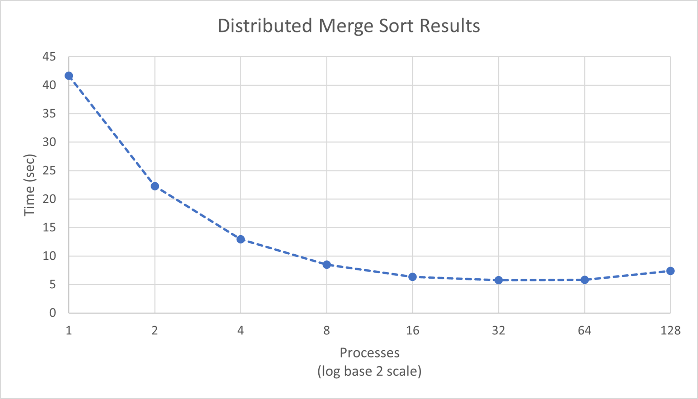

# Parallel Sort with MPI

> Adapted from a class project in High Performance Computing at the University of Tulsa.

The goal of this program is to implement a parallel version of merge sort. We will use this program to time the sorting of 1.28E8 items using 1, 2, 4, 8, 16, 32, 64, and 128 cores, as well as then graph those timing results to discuss the scalability of this process.

## Methodology

To make this program work, I had to design a communication scheme that on the gather step used a custom tree-structured gather to work alongside the merge sort algorithm. On the scatter step, I was able to use MPI's built in scatter function to quickly distribute the parts of the list each process needs. Once each process finishes the current processing step, it passes it down the tree to the next node, which moves on to the next processing step and continues the cycle until the full list sits in the root. After the root does the final processing step on the list, it returns.

To implement this idea, I used a bitmask and divisor to determine which nodes are continuing at each step, which nodes are sending at each step, and where the nodes send at each step. 

```c
int bmask = 1
int divisor = 2
while ( bmask < commSz ) {
	Paired Core = bmask XOR rank
	if ( rank % divisor == 0 ) {
		Receive from Paired Core
		Merge the received list and my list together
	} else {
		Send my list to Paired Core
		break
	}
	bmask <<= 1
	divisor *= 2
}
```

To do this, I did create a helper function known as merge to logically separate that operation from the control structures of the tree structured gather. This helper function takes three arrays and a count value. The first array is the final destination, the other two are the arrays to be sorted into the list, and count is the size of the final destination (the function assumes the two arrays are of equal size). This code looks as follows:

```c
void merge(int* fin, int* a, int* b, int count){
	int indA = 0;
	int indB = 0;
	int i = 0;
	while((indA<(count/2)) && indB<(count/2)){
		if(a[indA]<=b[indB]){
			fin[i++]=a[indA++];
		} else {
			fin[i++]=b[indB++];
		}
	}// While one
	while(indA<(count/2)){
		fin[i++]=a[indA++];
	}
	while(indB<(count/2)){
		fin[i++]=b[indB++];
	}
	return;
}
```

## Results

I was successfully able to create this merge sort system and get the algorithm working. The results/proof is in Appendix A, showing the first and last 20 sorted keys in the list. Along with this, I was able to time using the same methodology as for the Merge sort. These timings resulted in the following graph:



This graph shows a very interesting result- at first, before the 128 Processes run, it appears to be another simple diminishing returns problem, but the 128 processes run actually ends up taking longer than the 32 and 64 process runs. This implies that the algorithm (or at least my implementation of it on Hammer), is limited in scalability. In order for it to continue to scale, I think you'd have to add more items to the list, in order to have the sort time overcome the overhead time created by the tree-structured communication.

## Appendix A: First and Last 20 Sorted Items

```
[1] 19
[2] 41
[3] 80
[4] 80
[5] 87
[6] 121
[7] 135
[8] 136
[9] 149
[10] 162
[11] 180
[12] 231
[13] 234
[14] 242
[15] 267
[16] 283
[17] 302
[18] 317
[19] 326

[127999981] 2147483398
[127999982] 2147483405
[127999983] 2147483416
[127999984] 2147483439
[127999985] 2147483442
[127999986] 2147483445
[127999987] 2147483465
[127999988] 2147483465
[127999989] 2147483480
[127999990] 2147483490
[127999991] 2147483506
[127999992] 2147483516
[127999993] 2147483535
[127999994] 2147483555
[127999995] 2147483561
[127999996] 2147483587
[127999997] 2147483594
[127999998] 2147483609
[127999999] 2147483638
```

## Appendix B: Source

```c
/* mergeSort.c
 * Parallel Implementation of mergeSort using MPI
 */
#include <stdio.h>
#include <stdlib.h>
#include <time.h>
#include <mpi.h>

#define SIZE 1.28e8

int iComp(const void* a, const void* b);
void merge(int* fin, int* a, int* b, int count);

int main(int argv, char* argc[]){
	// Init MPI, get rank and Comm_sz
	MPI_Init(NULL,NULL);
	int commSz;
	MPI_Comm_size(MPI_COMM_WORLD, &commSz);
	int rank;
	MPI_Comm_rank(MPI_COMM_WORLD, &rank);
	int *list;// = (int*)calloc(SIZE,sizeof(int));
	// Root: Generate and distribute the list
	if(rank==0) {
		srand(255);
		list = (int*)calloc(SIZE,sizeof(int));
		for(int i=0;i<SIZE;i++){
			list[i]=rand();
		}
	}
	clock_t begin = clock();
	int count = SIZE/commSz;
	// Distributing the list? Hope this works
	int *indList = (int*)calloc(count,sizeof(int));
	int* temp = (int*)calloc(1,sizeof(int));
	int* sto= (int*)calloc(1,sizeof(int));
	MPI_Scatter(list,count, MPI_INT, indList,count,MPI_INT,0,MPI_COMM_WORLD);
	// For each: Phase 1, serial sort your part of the list using some low level method
	qsort(indList, count, sizeof(int), iComp);
	// Phase 2 onward: Tree structure reduction, merge-sorting as we climb up the tree structure.
	int bmask = 1;
	int divisor = 2;
	while ( bmask < commSz ) {
		if ( rank % divisor == 0 ) {
			// Receive from the Other Core, sort together
			temp = (int*)calloc(count, sizeof(int));
			// Use MPI_ANY_SOURCE to retreive on wildcard
			MPI_Recv(temp, count, MPI_INT, rank ^ bmask, 0, MPI_COMM_WORLD, MPI_STATUS_IGNORE);
			// Double my count / update the count value
			count *=2;
			sto = (int*) calloc(count, sizeof(int));
			// Sort together
			merge(sto, indList, temp, count);
			indList = (int*)calloc(count, sizeof(int));
			for(int i=0;i<count;i++) indList[i]=sto[i];
		} else {
			// Send my list to next core
			int nextCore = rank ^ bmask;
			MPI_Send(indList, count, MPI_INT, nextCore, 0, MPI_COMM_WORLD);
			break;
		}
		bmask <<= 1;
		divisor *= 2;
	}
	clock_t end = clock();
	if(rank==0){
		printf("%f", (double)(end-begin)/(CLOCKS_PER_SEC));
		// Finally, full list collapse in the root, merge sort one last time, then print results. Time based on root.
		fprintf(stderr, "Count %d\nFirst: %d, %d, %d, %d, %d \nLast %d, %d, %d, %d, %d\n",count, indList[1], indList[2], indList[3], indList[4], indList[5], indList[(int)SIZE-5], indList[(int)SIZE-4], indList[(int)SIZE-3], indList[(int)SIZE-2], indList[(int)SIZE-1]);
		for(int i =1;i<count;i++){
			if(indList[i]<indList[i-1]) printf("[FAILURE] Index %d\n", i);
		}
	}
	free(indList);
	free(temp);
	free(sto);
	MPI_Finalize();
	return 0;
}

int iComp(const void* a, const void* b){

	int uno = *((const int*)a);
	int dos = *((const int*)b);
	return uno-dos;
}

void merge(int* fin, int* a, int* b, int count){
	int indA = 0;
	int indB = 0;
	int i = 0;
	while((indA<(count/2)) && indB<(count/2)){
		if(a[indA]<=b[indB]){
			fin[i++]=a[indA++];
		} else {
			fin[i++]=b[indB++];
		}
	}// While one
	while(indA<(count/2)){
		fin[i++]=a[indA++];
	}
	while(indB<(count/2)){
		fin[i++]=b[indB++];
	}
	return;
}
```