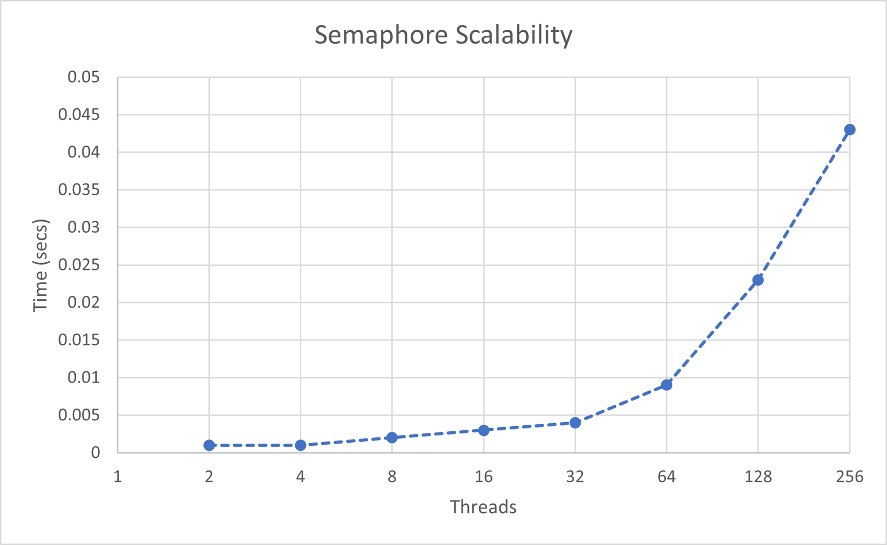

# Trapezoidal Rule Estimation with pThreads

> Adapted from a class project in High Performance Computing at the University of Tulsa.

The goal of this problem is to implement the trapezoidal rule using pThreads with three different methods of controlling the critical section. With these implementations we want to compare and contrast the three approaches.

## Methodology

The general algorithm for the trapezoidal rule is simple in serial form but implementing it with pThreads requires the extra steps of initializing and handling the threads we want to use. In this, the general outline of the algorithm each thread follows looked as follows:

```c
double a, b, h;
int n = 1000;
a = 0;
b = 10;
h = (b-a)/n;
n = n/thread_count;
a = a + my_rank*n*h;
b = a + n*h;
double my_result = (f(a) + f(b))/2.0;
double x;
for (int i = 1; i <= n-1; i++) {
    x = a + i*h;
    my_result += f(x);
}
my_result = my_result*h;
CRITICAL SECTION:
	global_result += my_result;
```

The difference between our three implementations will be the area around the critical section. There are many ways to implement a critical section, and we will investigate three: Busy Waiting, a Mutex, and a Semaphore.

First is busy waiting, which can be implemented using a flag variable. Each thread processes the critical section in order, when the flag reaches that thread's number. In our code this looks as follows:

```c
while(flag!=my_rank);
global_result += my_result;
flag = (flag+1)%thread_count;
```

Next is the use of a Mutex. In order to use a mutex, we have to initialize it in our main method, before we create our threads. pThreads provides a method, `pthread_mutex_init` that handles this for us, so once we've called that we can create our threads and use the mutex. To create our critical section, we do the following:

```c
pthread_mutex_lock(&mutex);
global_result += my_result;
pthread_mutex_unlock(&mutex);
```

Finally, we can use a Semaphore to implement our critical section. Similarly to a mutex, we have to initialize a semaphore before we can use it. However, different from a Mutex, pThreads doesn’t provide a semaphore implementation, so we have to use the general POSIX semaphore, from `semaphore.h`. To use a semaphore to create a critical section, we do the following:

```c
sem_wait(&semi);
global_result += my_result;
sem_post(&semi);
```

## Results

The first test of these implementations was whether they provided accurate estimates of the desired integral or not. To this, I used f(x)=x^2, and tested it on both the implementations and a calculator. These implementations were run on the a Virtual Machine using 100 threads. The results appeared as follows:

| Method | Estimation |
|---|---|
| Calculator | 333.3333 |
| Busy | 333.3335 |
| Semaphore | 333.3335 |
| Mutex | 333.3335 |

These results verified the accuracy and proper operation of the implementations. Each estimate was very close to the actual answer for the integral, giving us confidence in the implementations.

The next test of these implementations was to compare their runtimes. This was done using the `time` command on the virtual machine. With these runtimes, we could also calculate the speedup each implementation provides over the others.

| Method | Time | Speedup |
| --- | ---| --- |
| Busy | 36.529 | 1 |
| Mutex | 0.015 | 2435.267 |
| Semaphore | 0.02 | 1826.45 |

This table shows a large difference between busy waiting (used as the baseline) and the other two methods of enforcing a critical section. This result was expected; Mutexes and Semaphores are more efficient, thread-friendly methods of creating critical sections, but the extent of this result was unexpected.

Each of these implementations have their own advantages and disadvantages. Busy waiting has the advantage of being a simple, system-independent implementation, while Mutex and Semaphore have the advantage of speed. Similarly, Busy waiting's disadvantage would be it's speed with lots of threads, while Mutex and Semaphore have the disadvantage of being more system-specific and difficult to implement.

Finally, we wanted to test the scalability of this algorithm. For this, I used the Semaphore implementation and ran it under several counts of threads. This resulted in the following graph:



This graph shows that increasing the number of threads does not increase the efficiency, which implies that the problem is weakly scalable, because we'd need to increase the amount of work to increase the efficiency when using more threads.

## Appendix A: Busy Waiting Implementation

```c
/* Busy Waiting Trapazoid Rule for pThreads
 * - Uses Busy waiting for the critical section
 * - Compilation command:
 *	gcc -g -Wall -o test pTrapBusy.c -lpthread
 */
#include <stdlib.h>
#include <stdio.h>
#include <pthread.h>

int thread_count;
double global_result;
int flag = 0;

double f(double x){ // Function to be trapazoid-ruled
    return x*x; // f(x)=x^2
}

void *busyTrap(void* rank); // Thread function

int main(int argc, char** argv){
    // Initialize pThreads stuff
    long thread;
    pthread_t* thread_handles;

    // Get threads count from command line
    thread_count = strtol(argv[1], NULL, 10);

    // Thread Handles allocation
    thread_handles = calloc(thread_count, sizeof(pthread_t));

    // Spin up the Threads
    for(thread = 0; thread< thread_count; thread++){
        pthread_create(&thread_handles[thread], NULL, busyTrap, (void*) thread);
    }

    // Main Thread Computations
    printf("Hello from main\n");

    // Join the threads back to main center
    for(thread = 0; thread< thread_count; thread++){
        pthread_join(thread_handles[thread], NULL);
    }

    printf("Result: %f\n",global_result);
    // Deallocate things
    free(thread_handles);
    return 0;
}

void *busyTrap(void* rank){
    // Convert rank to number
    long my_rank = (long) rank;
    printf("Hello from %ld\n", my_rank);
    // Thread Computations
    // Calculate local a, b, c
    // Calculate h
    double a, b, h;
    int n = 1000;
    a = 0;
    b = 10;
    // a, b, n determination from that one HW problem?
    h = (b-a)/n;
    n = n/thread_count;
    a = a + my_rank*n*h;
    b = a + n*h;
    double my_result = (f(a) + f(b))/2.0;
    double x;
    for (int i = 1; i <= n-1; i++) {
	x = a + i*h;
        my_result += f(x);
    }
    my_result = my_result*h;
    // CRITICAL SECTION
    // Busy Section
    while(flag!=my_rank);
    global_result += my_result;
    printf("%ld :: %f +-> %f\n", my_rank, my_result, global_result);
    flag = (flag+1)%thread_count;
    // Prepare to join
    return NULL;
}
```

## Appendix B: Semaphore Implementation

```c
/* Semaphore Trapazoid Rule for pThreads
 * - Uses a semaphore for the critical section
 * - Compilation command:
 *	gcc -g -Wall -o test pTrapSemi.c -lpthread
 */
#include <stdlib.h>
#include <stdio.h>
#include <semaphore.h>
#include <pthread.h>

int thread_count;
double global_result;
sem_t semi;

double f(double x){ // Function to be trapazoid-ruled
    return x*x; // f(x)=x^2
}

void *semiTrap(void* rank); // Thread function

int main(int argc, char** argv){
    // Initialize pThreads stuff
    long thread;
    pthread_t* thread_handles;
    sem_init(&semi, 0, 1);

    // Get threads count from command line
    thread_count = strtol(argv[1], NULL, 10);

    // Thread Handles allocation
    thread_handles = calloc(thread_count, sizeof(pthread_t));

    // Spin up the Threads
    for(thread = 0; thread< thread_count; thread++){
        pthread_create(&thread_handles[thread], NULL, semiTrap, (void*) thread);
    }

    // Main Thread Computations
    printf("Hello from main\n");

    // Join the threads back to main center
    for(thread = 0; thread< thread_count; thread++){
        pthread_join(thread_handles[thread], NULL);
    }

    printf("Result: %f\n",global_result);
    // Deallocate things
    sem_destroy(&semi);
    free(thread_handles);
    return 0;
}

void *semiTrap(void* rank){
    // Convert rank to number
    long my_rank = (long) rank;
    printf("Hello from %ld\n", my_rank);
    // Thread Computations
    // Calculate local a, b, c
    // Calculate h
    double a, b, h;
    int n = 1000;
    a = 0;
    b = 10;
    // a, b, n determination from that one HW problem?
    h = (b-a)/n;
    n = n/thread_count;
    a = a + my_rank*n*h;
    b = a + n*h;
    double my_result = (f(a) + f(b))/2.0;
    double x;
    for (int i = 1; i <= n-1; i++) {
	x = a + i*h;
        my_result += f(x);
    }
    my_result = my_result*h;
    // CRITICAL SECTION
    sem_wait(&semi);
    global_result += my_result;
    printf("%ld :: %f +-> %f\n", my_rank, my_result, global_result);
    sem_post(&semi);
    // Prepare to join
    return NULL;
}
```

## Appendix C: Mutex Implementation

```c
/* Mutex Trapazoid Rule for pThreads
 * - Uses a mutex for the critical section
 * - Compilation command:
 *	gcc -g -Wall -o test pTrapBusy.c -lpthread
 */
#include <stdlib.h>
#include <stdio.h>
#include <pthread.h>

int thread_count;
double global_result;
int flag = 0;
pthread_mutex_t mutex;


double f(double x){ // Function to be trapazoid-ruled
    return x*x; // f(x)=x^2
}

void *mutexTrap(void* rank); // Thread function

int main(int argc, char** argv){
    // Initialize pThreads stuff
    long thread;
    pthread_t* thread_handles;
    pthread_mutex_init(&mutex, NULL);

    // Get threads count from command line
    thread_count = strtol(argv[1], NULL, 10);

    // Thread Handles allocation
    thread_handles = calloc(thread_count, sizeof(pthread_t));

    // Spin up the Threads
    for(thread = 0; thread< thread_count; thread++){
        pthread_create(&thread_handles[thread], NULL, mutexTrap, (void*) thread);
    }

    // Main Thread Computations
    printf("Hello from main\n");

    // Join the threads back to main center
    for(thread = 0; thread< thread_count; thread++){
        pthread_join(thread_handles[thread], NULL);
    }

    printf("Result: %f\n",global_result);
    // Deallocate things
    pthread_mutex_destroy(&mutex);
    free(thread_handles);
    return 0;
}

void *mutexTrap(void* rank){
    // Convert rank to number
    long my_rank = (long) rank;
    printf("Hello from %ld\n", my_rank);
    // Thread Computations
    // Calculate local a, b, c
    // Calculate h
    double a, b, h;
    int n = 1000;
    a = 0;
    b = 10;
    // a, b, n determination from that one HW problem?
    h = (b-a)/n;
    n = n/thread_count;
    a = a + my_rank*n*h;
    b = a + n*h;
    double my_result = (f(a) + f(b))/2.0;
    double x;
    for (int i = 1; i <= n-1; i++) {
	x = a + i*h;
        my_result += f(x);
    }
    my_result = my_result*h;
    // CRITICAL SECTION
    pthread_mutex_lock(&mutex);
    global_result += my_result;
    printf("%ld :: %f +-> %f\n", my_rank, my_result, global_result);
    pthread_mutex_unlock(&mutex);
    // Prepare to join
    return NULL;
}
```