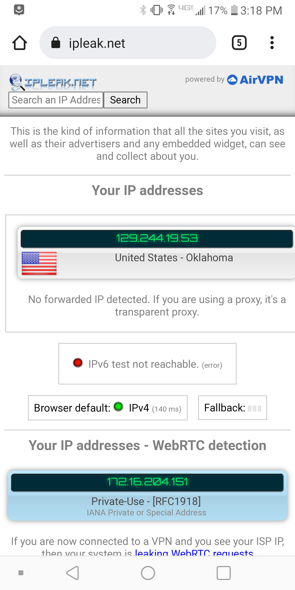
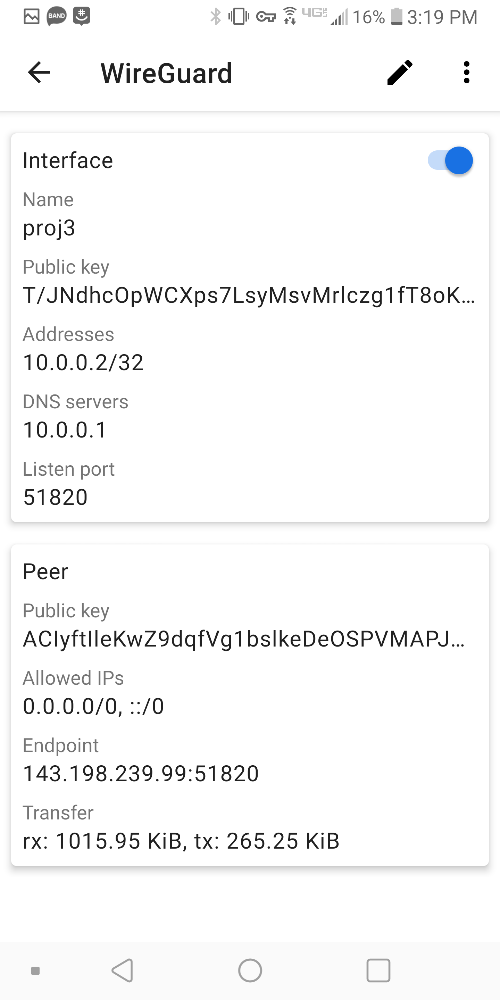
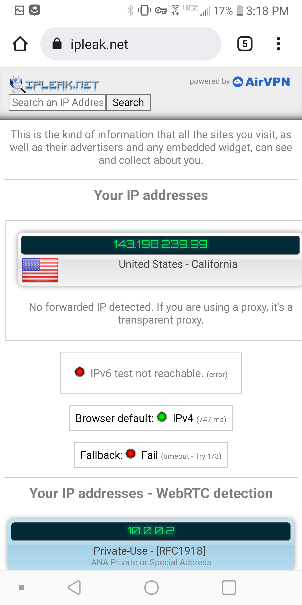
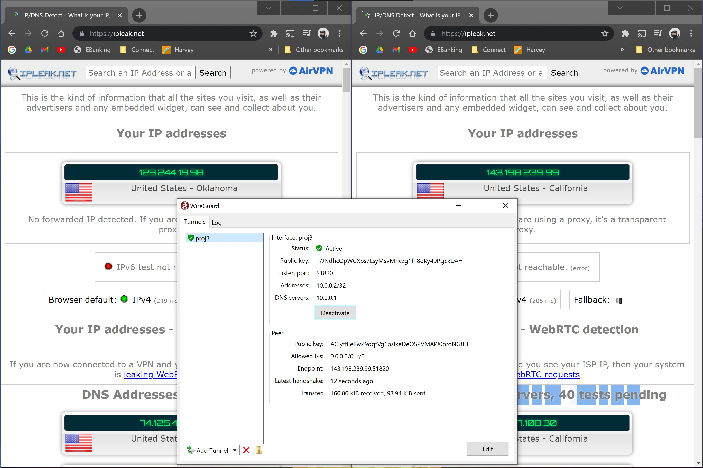

# Docker Lab: Wireguard VPN

## Installation Instructions

### Step 1: Sign up for DigitalOcean

The first step is to sign up for an Account on DigitalOcean. This will allow us to create a virtual machine (called a "Droplet" by DigitalOcean) to run our VPN on. For this demonstration, I used a special signup link to get $100 Credit for 2 months of use.
https://m.do.co/c/4d7f4ff9cfe4

### Step 2: Creating our Droplet

For this project we're using a basic, Ubuntu 20.04 Droplet with all the basic options. To simplify the demonstration and installation, I used a password rather than an SSH key. If you're setting this up for a more secure VPN system, I would suggest using an SSH key.

### Step 3: Installing Docker

For this, I used a template tutorial hosted by DigitalOcean at https://www.digitalocean.com/community/tutorials/how-to-install-and-use-docker-compose-on-ubuntu-20-04 . Those instructions are all listed here.

Use the following commands:
```
sudo curl -L "https://github.com/docker/compose/releases/download/1.27.4/docker-compose-$(uname -s)-$(uname -m)" -o /usr/local/bin/docker-compose
sudo chmod +x /usr/local/bin/docker-compose
docker-compose --version
```

At the end, you should see an output giving you a docker-compose version and build. If you see that, Docker has been sucessfully installed.

### Step 4: Setting up our Docker-Compose File

First we want to create a directory to work in, and then we'll nano into our docker-compose file.

```
mkdir -p ~/wireguard/
mkdir -p ~/wireguard/config/
nano ~/wireguard/docker-compose.yml
```

In this file, we'll put the following:

```
version: '3.8'
services:
  wireguard:
    container_name: wireguard
    image: linuxserver/wireguard
    environment:
      - PUID=1000
      - PGID=1000
      - TZ=America/Chicago
      - SERVERURL=1.2.3.4
      - SERVERPORT=51820
      - PEERS=pc1,pc2,phone1
      - PEERDNS=auto
      - INTERNAL_SUBNET=10.0.0.0
    ports:
      - 51820:51820/udp
    volumes:
      - type: bind
        source: ./config/
        target: /config/
      - type: bind
        source: /lib/modules
        target: /lib/modules
    restart: always
    cap_add:
      - NET_ADMIN
      - SYS_MODULE
    sysctls:
      - net.ipv4.conf.all.src_valid_mark=1
```

There are some modifications to make to this file. FIrst, we need to ensure the timezones match, under Environment->TZ. Second, We want to change Environment->SERVERURL to our droplet's Public IP address. Once we make these modifications, we can save and exit the file. Now we can start Wireguard using the following:

```
cd ~/wireguard/
docker-compose up -d
```

If everything works, you should see a message `Creating wireguard... done`.

## Testing our Installation

### Test 1: Mobile System

First I'll show the orignal IP address of the phone:


Then, with our setup, we get a different IP:




### Test 2: Desktop



